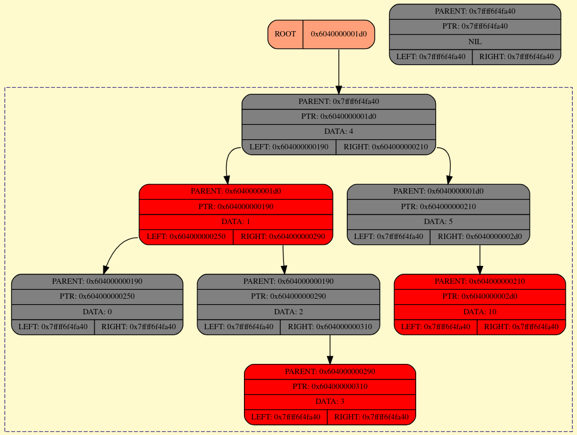

# RedBlackTree
Red-black tree implementation on C++

[](#)

[](#)
[](#)

[](#)
[](#)
[](#)

## Dependencies

Compiler c/c++(clang preferable), cmake, python, gtest, boost, graphviz

```shell
apt-get install build-essential clang ninja-build make cmake python3 libboost graphviz
apt-get install libgtest-dev libgmock-dev libtbb-dev
```

## Building

Using CMake, you can specify 2 options:
- `SANITIZE`: enables sanitizers for gcc/clang compilers.
- `BUILD_TESTS`: build unit tests with GTest.

### Config

*Debug:*
```shell
cmake -G Ninja -DCMAKE_BUILD_TYPE=Debug -DCMAKE_EXPORT_COMPILE_COMMANDS=ON -DBUILD_TESTS=ON -DSANITIZE=ON -DCMAKE_CXX_COMPILER=clang++ -S . -B build
```

*Release:*
```shell
cmake -G Ninja -DCMAKE_BUILD_TYPE=Release -DCMAKE_CXX_COMPILER=clang++ -S . -B build
```

### Build
```shell
cmake --build build
```

Binaries are located in `build/bin/`

### Install 

```shell
cmake --install build --prefix ~/my_software
```

## Usage

## Visualisation

Using GraphViz tool, you can print red-black tree to HTML

Enable logging tree in constructor with second argument as true(default false)

```cpp
Tree::RBTree<int, bool (*)(int, int)> rbtree(comparator, true);
```

To print current state of tree use `printTree()` method.

Storage of logs: `/tmp/rbtree_log/log.html`, all objects has format SVG.

Example:


## Tests

Google Tests, for run do:

```shell
ctest --test-dir build/tests/unittests --output-on-failure
```

Python Tests, for run do:

```shell
python3 tests/e2e/run.py --bin build/bin/rbtree
```

Useful archive with tests set and script for run rbtree - `tests/e2e.tar.gz`

## Workflow

Pipeline runs in 2 stages:
- `build`: debug build project & create artifact.
- `tests`: run tests for build
    + `UnitTests`: tests/unittests run with GTest
    + `End2EndTests`: tests/e2e run with Python