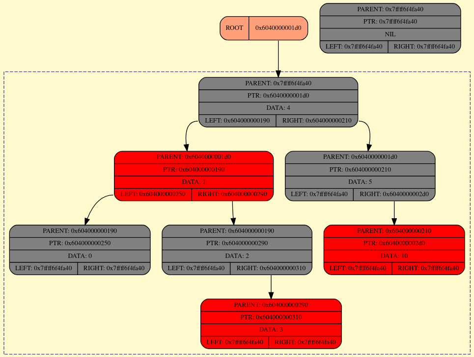

# RedBlackTree
Red-black tree implementation on C++

[](#)

[](#)
[](#)

[](#)
[](#)
[](#)

## Dependencies

Compiler c/c++ and libstdc++ >= 13, cmake, python, gtest, boost, graphviz

```shell
apt-get install build-essential ninja-build make cmake python3 libboost-dev graphviz
apt-get gcc-13 g++-13 libstdc++-13-dev
apt-get install libgtest-dev libgmock-dev libtbb-dev
```

## Building

Using CMake, you can specify 3 options:
- `SANITIZE`: enables sanitizers for gcc/clang compilers.
- `BUILD_TESTS`: build unit tests with GTest.
- `TIME_COUNT`: add bench targets with time measurement.
- `VIS_LOGS`: add interface to generate visual logs.

### Config

*Debug:*
```shell
cmake -G Ninja -DCMAKE_BUILD_TYPE=Debug -DCMAKE_EXPORT_COMPILE_COMMANDS=ON -DBUILD_TESTS=ON -DSANITIZE=ON -DCMAKE_CXX_COMPILER=g++-13 -S . -B build
```

*Release:*
```shell
cmake -G Ninja -DCMAKE_BUILD_TYPE=Release -DCMAKE_CXX_COMPILER=g++-13 -DBUILD_TESTS=ON -DTIME_COUNT=ON -S . -B build
```

### Build

```shell
cmake --build build
```

Binaries are located in `build/bin/`

### Install 

```shell
cmake --install build --prefix ~/my_software
```

## Usage

### Functional

+ `insert(key)` insert key in balanced tree
+ `rangeQuery(first, second)` method returns amount of number in `[first, second)`

### Task

For `rbtree` and `set` targets:

Input:
```
k 10 k 20 q 8 31 q 6 9 k 30 k 40 q 15 40
```
Output:
```
2 0 2 
```

### Bench

Use targets `rbtree-bench` and `set-bench` to measure insert and RQ processing time:

With same input, output will be - time measurments:

```
Total insert time (in s): 2.57728
Total rq     time (in s): 0.26747
Total run    time (in s): 3.5384
```

## Visualisation

Using GraphViz tool, you can print red-black tree to HTML

Enable logging tree in constructor with second argument as true(default false)

```cpp
Tree::RBTree<int, bool (*)(int, int)> rbtree(comparator, true);
```

To print current state of tree use `printTree()` method.

Storage of logs: `/tmp/rbtree_log/log.html`, all objects has format SVG.

Example:


## Tests

Google Tests, for run do:

```shell
ctest --test-dir build/tests/unittests --output-on-failure
```

Python Tests, for run do:

```shell
python3 tests/e2e/run.py --bin build/bin/rbtree
```

## Benchmarks

To confirm optimality algorithm of my red-black tree and range query method, I create big tests and compare work time of program based on my RBTree and std::set (with its method that used lower_bound and std::distance)

Bench tests in `tests/bench/`

Script for generating tests: `tests/bench/gen.py`

Results in [BENCH.md](./BENCH.md)

## Workflow

Pipeline runs in 2 stages:
- `build`: debug build project & create artifact.
- `tests`: run tests for build
    + `UnitTests`: tests/unittests run with GTest
    + `End2EndTests`: tests/e2e run with Python